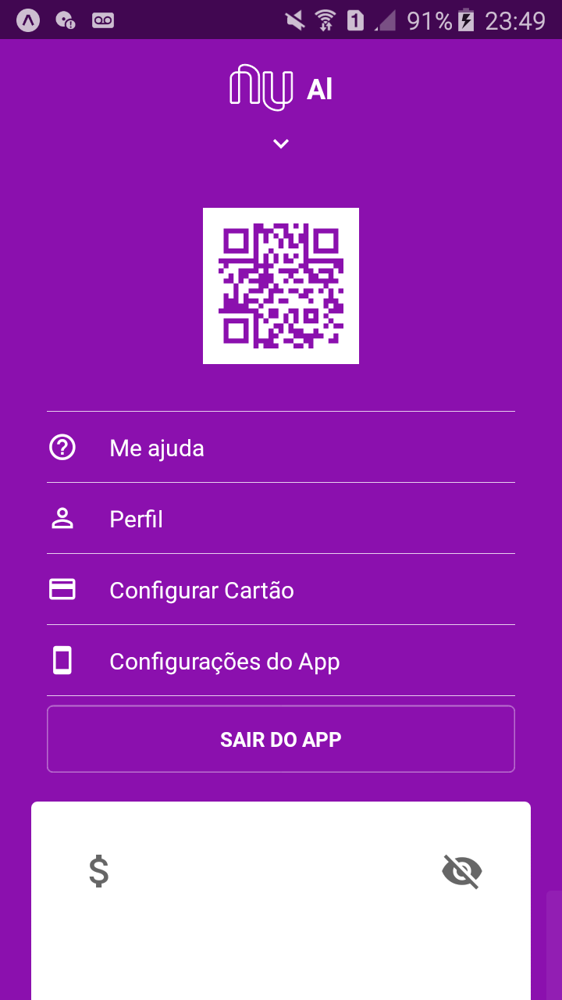

# Clone Nubank
 Clone da interface do nubank

 

  
  

## Requisitos
    Instalar o Git
    https://git-scm.com/downloads

    Instalar o NodeJs
    https://nodejs.org/en/

    Installar o Expo CLI
    https://docs.expo.io/get-started/installation/

## Primeiro passo - baixar o projeto
Faça download do repositório acima ou use o seguinte comando na pasta onde deseja baixar o projeto:
 - git clone https://github.com/AloisioFernandes/clone-nubank.git

## Segundo passo - instalar dependências
Digite o seguinte comando dentro da pasta mobile através do terminal:
 - npm install

## Terceiro passo - iniciar app
Dentro da pasta mobile, digite o seguinte comando no terminal: 
 - expo start

Utilize o aplicativo do expo ou um emulador para executar o app.